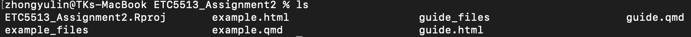
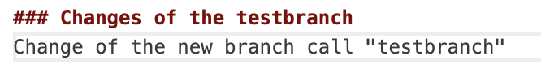
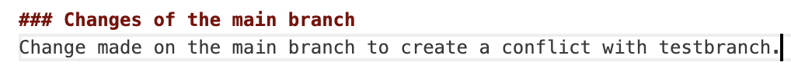

# INTRODUCTION
This is an reproducible workbook to demonstrated the guide of knowledge of Git and GitHub usage.

# WORKING GUIDELINE

### 1. Creating a new RStudio Project and Quarto file

**First, you need to create a new RStudio Project called "ETC5513_Assignment2" and use the following command to create a simple qmd file called example.qmd.**

- The command `cd` is used to move your head into the project folder. 

```bash
cd ETC5513_Assignment2
```

- The command `touch filename.qmd` create a new empty Quarto file.

```bash
touch example.qmd
 ```

- To make it be knitted into a HTML file, you need to write the YAML format of html and render it. 
 
```{r}
#| echo: true
#| eval: false
---
title: "GitHub reproducible workbook"
author: "YU-LIN CHUNG, 35480351"
format:
    html:
        toc: true
        theme: solar
---
```

- The command `ls` will list all of the file in "ETC5513_Assignment2". It can be seen that we successfully knitted the file into HTML when there is a file call "example .html"




\newpage
### 2. Initialising the folder as a Git repository

**After creating and rendering example.qmd, we can use the following command to initialise the project folder as a Git repository.**

- The command `git init` create a new local Git repository in the project folder. 

```bash
git init
```

- The command `git add` will add the change into the staging area. The dot means the current directory. THerefore, `git add .` stages all changes in the current project folder.

```bash
git add .
```

- The command `git commit` create the first commit in the repository. We usually add the message with `-m` to remind us for our implement.

```bash
git commit -m "Inital update"
```

\newpage
### 3. Create the new branch and add the changes

**Now we need to do two things: First, create a new branch called testbranch. Second, modify the file example.qmd and add the changes to both the local and remote repositories.**

- To make sure we are in the main branch. The command `git branch` can ensure where you are if you see an asterisk symbol in fornt of the branch name.

```bash
git branch
```

- The command `git switch` will create a new branch and switch you to this branch.

```bash
git switch -c testbranch
```

- After modifying example.qmd, we can use `git status` to check the status of it.

```bash
git status
```

- Following the above steps, we need to add the modified file to the staging area with the command `git add` and commit the change to the local repository with the command `git commit` and write the message for it.

```bash
git add example.qmd
git commit -m "Modify example.qmd on testbranch"
```

- Finally, we need to push the new branch and its commit to the remote GitHub repository by using command `git push`. However, because it is the first time to push the new branch to GitHub, we need to set up upstream with `-u`

```bash
git push -u origin testbranch
```

\newpage
### 4. Add the data and amend the previous commit

**Next, we need to create a folder called data, and add the data from Assignment 1 to that folder.**

- We need to made sure we are working on testbranch. The command `git branch` will show where you are with the asterisk symbol in fornt of the branch name.

```bash
git branch
```

- The command `mkdir` create a new folder.

```bash
mkdir data
```

- The command `cp` is used to copy the data in to the folder "data" .

```bash
cp "/Users/zhongyulin/assignment-1-creating-reproducible-reports-yulinchung/data/35480351_Yu-Lin Chung.csv" data/
```

- The command `cd` is used to move into sepcific folder and we can use `ls` to check that the file had been copied successfully.

```bash
cd data
ls
```

**After that, we will learn how to amend the previous commit to include the data folder and push this amended commit to the remote.**

- Instead of creating a new commit, we need to amend the previous commit. The command `git commit --amend` modifies the most recent commit. The option `-m` allows us to write a new commit message.

```bash
git commit --amend -m "Modify example.qmd and add data folder"
```

- Finally, we need to push it to the remote GitHub repository by using command `git push`. However, because we amended a commit that had already been pushed, the commit history changed. Therefore, we need to use `git push -f` rather than a normal `git push` to force GitHub to update the remote branch.

```bash
git push -f origin testbranch
```

\newpage
### 5. Create merge conflict

- Typing some similar content in main branch as the same position in testbranch.





### 6. Deal with merge conflict